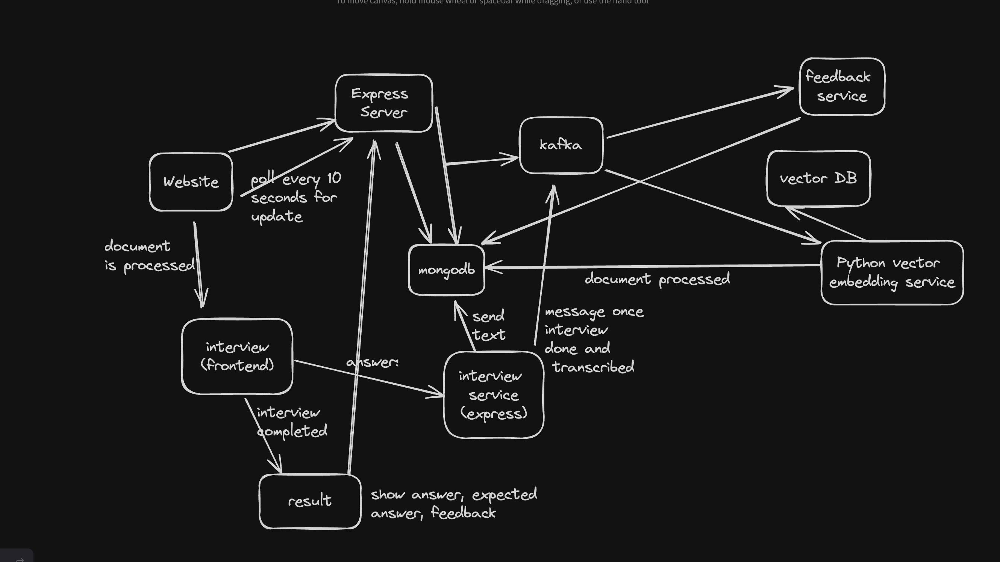

# Automated Interview Platform

A automated online interview platform for the recruitment process.

## Stack

-   [Node.js](https://nodejs.org/)
-   [Express](https://expressjs.com/)
-   [MongoDB](https://www.mongodb.com/)
-   [Docker](https://www.docker.com/)
-   [Docker Compose](https://docs.docker.com/compose/)
-   [Apache Kafka](https://kafka.apache.org/)
-   [Next.js](https://nextjs.org/)
-   [Python](https://www.python.org/)
-   [Gemini API](https://ai.google.dev/)

## Architecture



## How to run

```console
git clone https://github.com/ItsSpirax/Automated-Interview-Platform
cd Automated-Interview-Platform
```

Set up MongoDB password:

```console
nano docker-compose.yml
```

Configure environment variables:

```console
cp .env.example .env
nano .env
```

Start the application:

```console
docker compose up -d
```
